# CS305B Lab1 Report

*11812418 樊青远 Fan Qingyuan*

## Q1

> Use the ipconfig command to query the local ip, subnet mask, gateway, MAC address, and screenshot instructions.

```bash
>ifconfig
en0: flags=8863<UP,BROADCAST,SMART,RUNNING,SIMPLEX,MULTICAST> mtu 1500
	options=400<CHANNEL_IO>
	ether 38:f9:d3:75:70:88 
	inet6 fe80::472:9e7f:3642:1950%en0 prefixlen 64 secured scopeid 0xa 
	inet 10.17.120.246 netmask 0xffff8000 broadcast 10.17.127.255
	inet6 2001:da8:201d:1109::f762 prefixlen 128 dynamic 
	nd6 options=201<PERFORMNUD,DAD>
	media: autoselect
	status: active
```

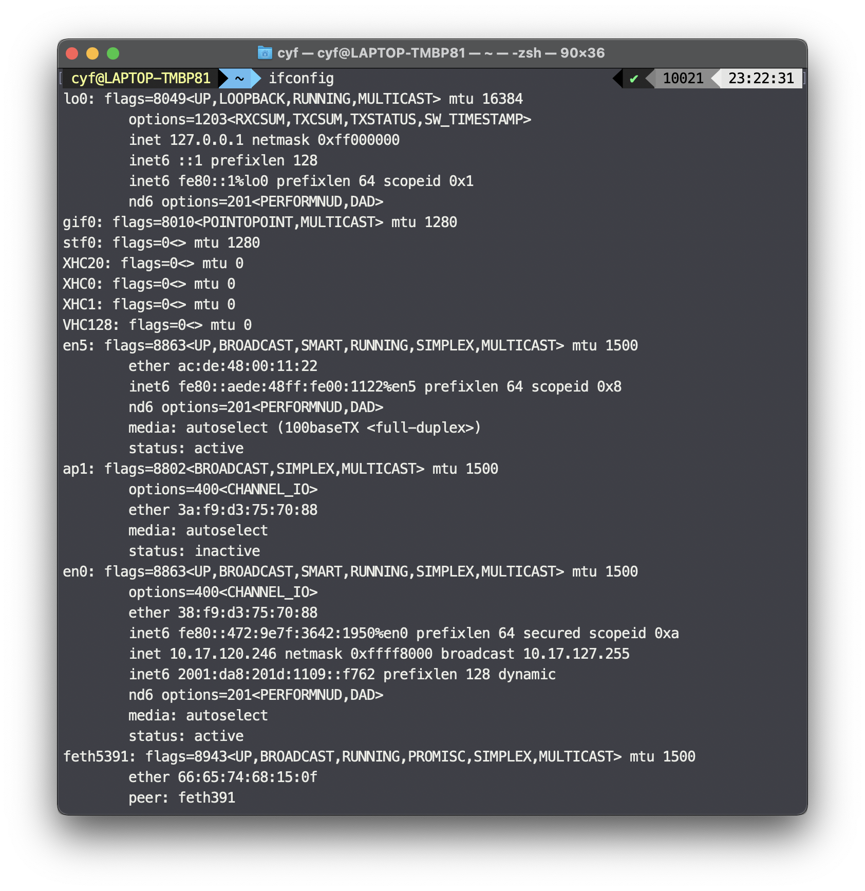

### Result

| Parameters  | Value                        |
| ----------- | ---------------------------- |
| Local IP    | `10.17.120.246`              |
| Subnet mask | 0xffff8000 (`255.255.128.0`) |
| Gateway     | `10.17.127.255`              |
| MAC address | `38:f9:d3:75:70:88`          |


## Q2

> Ping www.baidu.com and ping www.sustc.edu.cn, the screenshot gives a brief description of the echo message (whether the destination host is reachable, the communication duration, the TTL value)

### ping www.baidu.com

```bash
>ping www.baidu.com
PING www.a.shifen.com (14.215.177.38): 56 data bytes
64 bytes from 14.215.177.38: icmp_seq=0 ttl=54 time=7.229 ms
64 bytes from 14.215.177.38: icmp_seq=1 ttl=54 time=20.660 ms
64 bytes from 14.215.177.38: icmp_seq=2 ttl=54 time=9.278 ms
64 bytes from 14.215.177.38: icmp_seq=3 ttl=54 time=25.890 ms
^C
--- www.a.shifen.com ping statistics ---
4 packets transmitted, 4 packets received, 0.0% packet loss
round-trip min/avg/max/stddev = 7.229/15.764/25.890/7.769 ms
```

#### Screenshot


### ping www.sustc.edu.cn

```bash
>ping www.sustc.edu.cn
PING www.sustc.edu.cn (172.18.8.244): 56 data bytes
64 bytes from 172.18.8.244: icmp_seq=0 ttl=62 time=2.850 ms
64 bytes from 172.18.8.244: icmp_seq=1 ttl=62 time=21.632 ms
64 bytes from 172.18.8.244: icmp_seq=2 ttl=62 time=21.563 ms
64 bytes from 172.18.8.244: icmp_seq=3 ttl=62 time=10.690 ms
^C
--- www.sustc.edu.cn ping statistics ---
4 packets transmitted, 4 packets received, 0.0% packet loss
round-trip min/avg/max/stddev = 2.850/14.184/21.632/7.915 ms
```

#### Screenshot

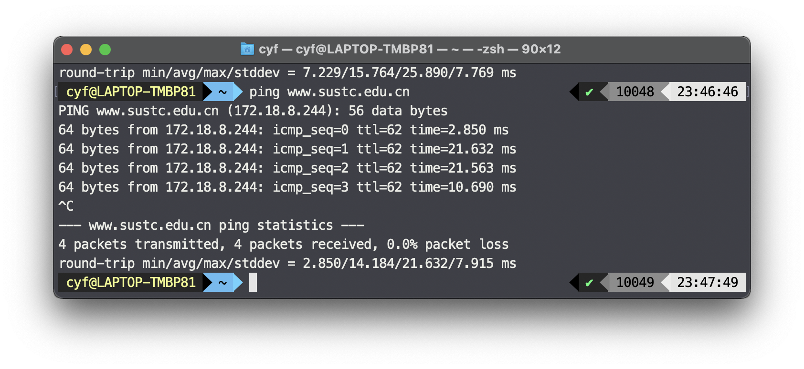

## Q3

> Use the netstat command to check the traffic statistics on the local Ethernet card and take a screenshot

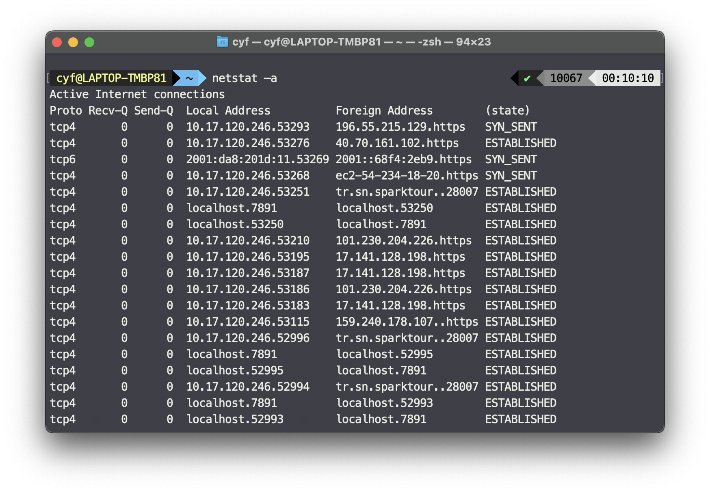

## Q4

> Use the tracert command to access www.baidu.com and take a screenshot analysis to mark the total number of hops from the host to the destination host, whether there is any icmp packet loss, and the ip address of the server where www.baidu.com is located.

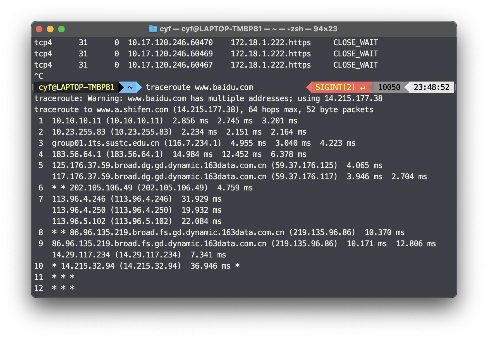

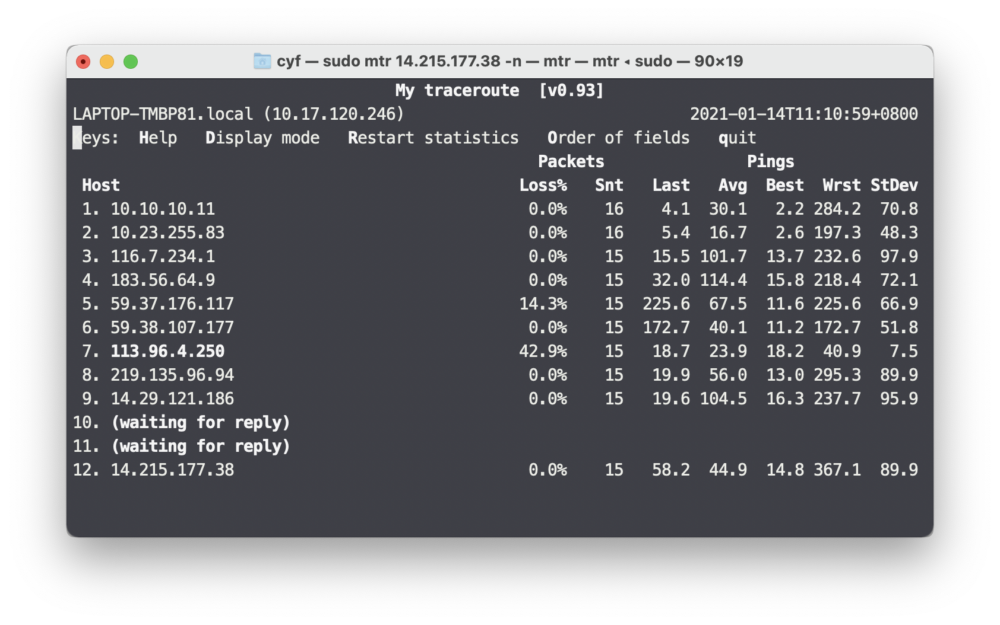

The total number of hops from the host to the destination host is `12`. (The traceroute program always indicates that the packet was lost at the 12th hop, so the result is obtained from mtr)

There are packet loss at the 6th, 6th, 10th of the hops from the traceroute result.

The IP address of the baidu server is `14.215.177.38`.


## Q5

> In this lab class, list the commands that requires addition parameters to run. Use these commands and parameters (each command chooses 2 or 3 of them to experiment), take a screenshot and explain its function. 

### ping

```bash
usage: ping [-AaDdfnoQqRrv] [-c count] [-G sweepmaxsize]
            [-g sweepminsize] [-h sweepincrsize] [-i wait]
            [-l preload] [-M mask | time] [-m ttl] [-p pattern]
            [-S src_addr] [-s packetsize] [-t timeout][-W waittime]
            [-z tos] host
       ping [-AaDdfLnoQqRrv] [-c count] [-I iface] [-i wait]
            [-l preload] [-M mask | time] [-m ttl] [-p pattern] [-S src_addr]
            [-s packetsize] [-T ttl] [-t timeout] [-W waittime]
            [-z tos] mcast-group
Apple specific options (to be specified before mcast-group or host like all options)
            -b boundif           # bind the socket to the interface
            -k traffic_class     # set traffic class socket option
            -K net_service_type  # set traffic class socket options
            -apple-connect       # call connect(2) in the socket
            -apple-time          # display current time
```

`ping -c ` means the count the `ping ` command runs. e.g. `ping -c 10 1.2.4.8`

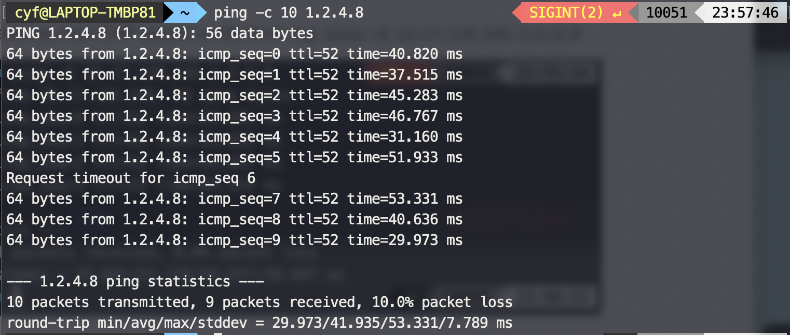

`ping -S` means specific the address that ICMP packet sends from. e.g. `ping -S 10.17.120.246 1.2.4.8 ` 

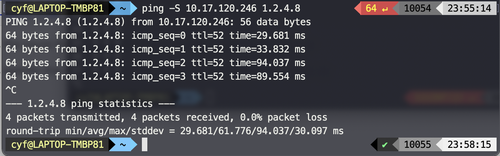

### Traceroute

```bash
Version 1.4a12+Darwin
Usage: traceroute [-adDeFInrSvx] [-A as_server] [-f first_ttl] [-g gateway] [-i iface]
	[-M first_ttl] [-m max_ttl] [-p port] [-P proto] [-q nqueries] [-s src_addr]
	[-t tos] [-w waittime] [-z pausemsecs] host [packetlen]
```

`traceroute -i` means traceroute using the specific interface. e.g. `traceroute -i en0 1.0.0.1`

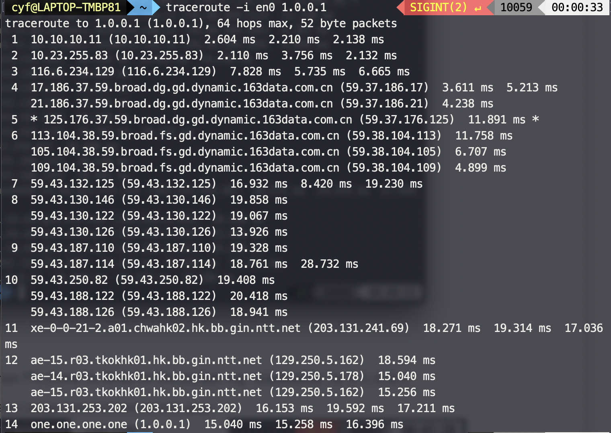

`traceroute -m` specific the max TTL (Time To Live) for the packet. e.g. `traceroute -m 3 1.0.0.1 `

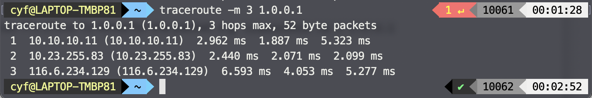

### Nslookup

`nslookup -query=AAAA www.cloudflare.com 172.18.1.92` means query the `AAAA` record of `www.cloudflare.com` from DNS server  `172.18.1.92`.

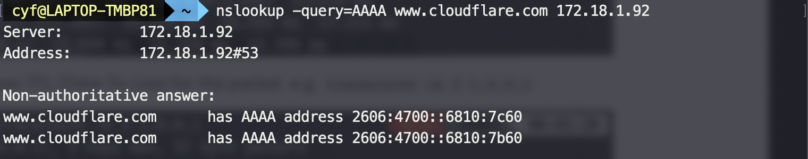

`nslookup -query=TXT xn--g28h.hack.ustclug.org 172.18.1.92` means query the `AAAA` record of `xn--g28h.hack.ustclug.org` from DNS server  `172.18.1.92`.


## Q6

> Download and install WireShark: https://www.wireshark.org/

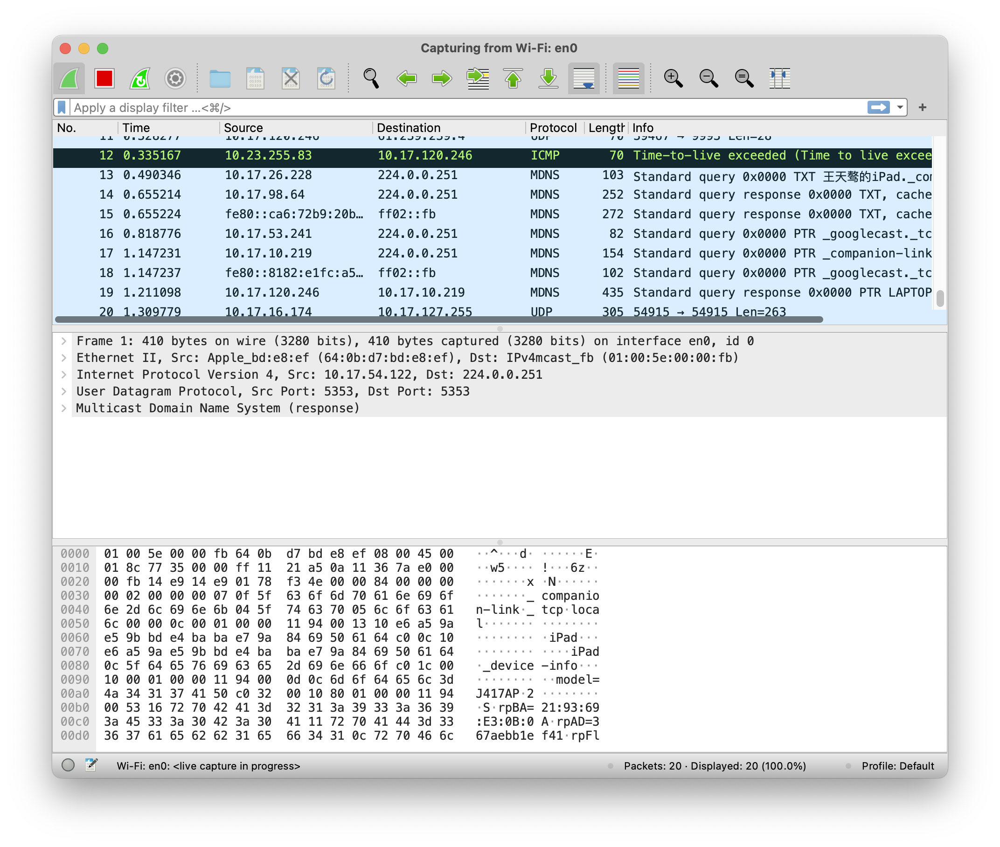