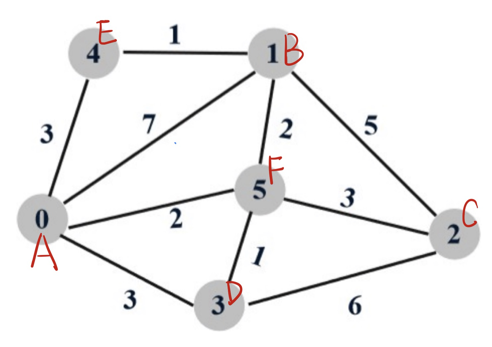
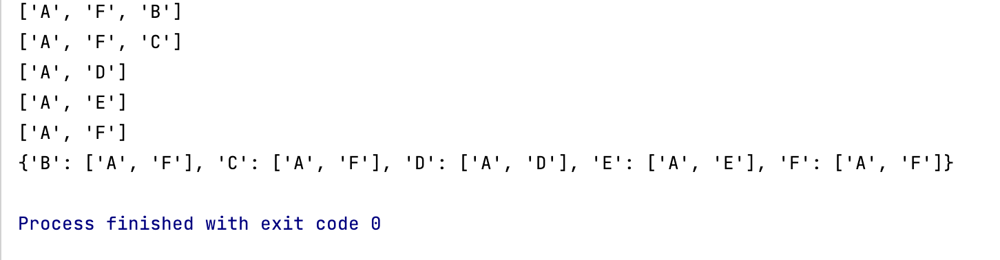

# CS305B Lab 12 Report -- Dijkstra Algorithm

*11812418 FanQingyuan*

---

## Algorithm Introduction

Dijkstra's algorithm is an algorithm for finding the shortest paths between nodes in a graph, which may represent, for example, road networks. Dijkstra's original algorithm found the shortest path between two given nodes, but a more common variant fixes a single node as the "source" node and finds shortest paths from the source to all other nodes in the graph, producing a shortest-path tree.

In this lab, we will use the Dijkstra's algorithm to find the shortest path of the network packet to travel, and use the result to construct a forwarding table.

## Code, Screenshots and Analysis

To make things clear, we assign the letter A, B, C, D, E to each node of the network:



Then, we convert the graph into a dictionary structure in python:

```python
graph = {
    'A': {'E': 3, 'B': 7, 'F': 2, 'D': 3},
    'B': {'E': 1, 'A': 7, 'F': 2, 'C': 5},
    'C': {'B': 5, 'F': 3, 'D': 6},
    'D': {'C': 6, 'F': 1, 'A': 3},
    'E': {'B': 1, 'A': 3},
    'F': {'C': 3, 'D': 1, 'A': 2, 'B': 2}
}
```

We also define a `search` function to do the search process, and `backpedal` method for returning the shortest path:

```python
costs = {'A': inf, 'B': inf, 'C': inf, 'D': inf, 'E': inf, 'F': inf}

parents = {}


def search(source, target, graph, costs, parents):
    costs[source] = 0
    nextNode = source

    while nextNode != target:

        for neighbor in graph[nextNode]:

            if graph[nextNode][neighbor] + costs[nextNode] < costs[neighbor]:
                costs[neighbor] = graph[nextNode][neighbor] + costs[nextNode]
                parents[neighbor] = nextNode
            del graph[neighbor][nextNode]
        del costs[nextNode]
        nextNode = min(costs, key=costs.get)
    return parents
```

```python
def backpedal(source, target, searchResult):
    node = target

    backpath = [target]

    path = []

    while node != source:
        backpath.append(searchResult[node])

        node = searchResult[node]

    for i in range(len(backpath)):
        path.append(backpath[-i - 1])

    return path
```

At the end of the code, we use a function called `print_forward_table` to call the search function above and print the forwarding table of the route starting from the source:

```python
def router_table(src, dst):

    costs_tmp = {'A': inf, 'B': inf, 'C': inf, 'D': inf, 'E': inf, 'F': inf}
    graph = {
    'A': {'E': 3, 'B': 7, 'F': 2, 'D': 3},
    'B': {'E': 1, 'A': 7, 'F': 2, 'C': 5},
    'C': {'B': 5, 'F': 3, 'D': 6},
    'D': {'C': 6, 'F': 1, 'A': 3},
    'E': {'B': 1, 'A': 3},
    'F': {'C': 3, 'D': 1, 'A': 2, 'B': 2}
}
    parents = {}
    result = search(src, dst, graph, costs_tmp, parents)
    path = backpedal(src, dst, result)
    next_hop = path
    return next_hop

# print forwarding table
# the value of each key is the link that the packet should go
def print_forward_table(src):
    fwd_table = {'A': 0, 'B': 0, 'C': 0, 'D': 0, 'E': 0, 'F': 0}
    del fwd_table[src]
    for dst in fwd_table:
        link_array = [src]
        table = router_table(src,dst)
        link_array.append(table[1])
        print(table)
        fwd_table[dst] = link_array
    return fwd_table
```

To test our function, we use node A(`0`) as an example:

```python
print(print_forward_table("A"))

['A', 'F', 'B']
['A', 'F', 'C']
['A', 'D']
['A', 'E']
['A', 'F']
{'B': ['A', 'F'], 'C': ['A', 'F'], 'D': ['A', 'D'], 'E': ['A', 'E'], 'F': ['A', 'F']}
```

The first five line of the result is the shortest path from the source to each node, and the last line is the desired forwarding table.



## Summary

With the help of Dijkstra's algorithm, we could find the shortest path and get the corresponding forwarding table in the complex network like the computer network in the real world with ease. Therefore, relevant search algorithms are very important in computer networks.