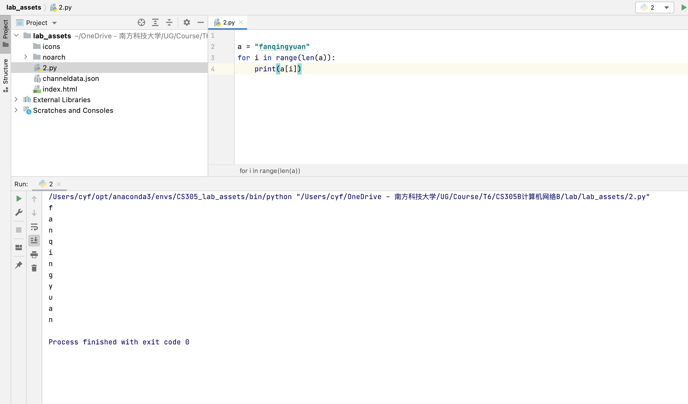

# CS305B Lab2 Report

*11812418 樊青远 Fan Qingyuan*

## On-class assignment



## Assignment

### `HiPython.py`

```python
def HiPython():
    print("hi, I’m programing in \"python\"")
```

### `max_min.py`

```python
def find_max_min(list):
    list_max = max(list)
    list_min = min(list)
    return list_max, list_min
```

### `cat.py`

```python
class cat:
    def __init__(self, name):
        self.name = name
    def meow(self):
        return self.name + " meow"
```

### `test.py`

```python
import cs205b_lab2

cs205b_lab2.HiPython()

alist = [5,-1,8,-99,7,100,56,-34]
amax,amin = cs205b_lab2.find_max_min(alist)
print("max=%d,min=%d" % (amax,amin))

mycat = cs205b_lab2.cat("Persian cat")
print(mycat.meow())
```

## `test.py` Execution result

```bash
hi, I’m programing in "python"
max=100,min=-99
Persian cat meow
```

