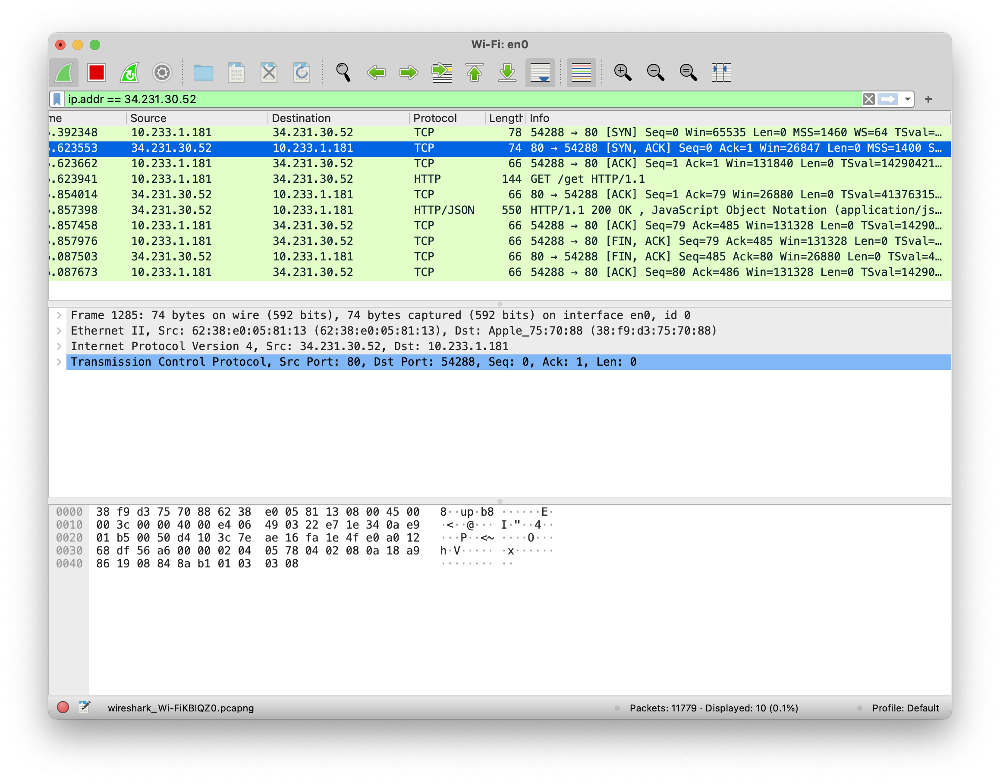
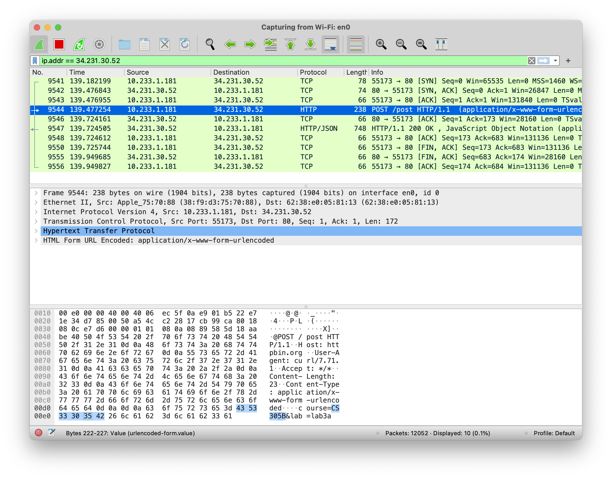

# CS305B Lab3 Report

*11812418 樊青远 Fan Qingyuan*

## Using cURL make GET request to http://httpbin.org/get

```shell
curl -v http://httpbin.org/get
```

```shell
*   Trying 34.231.30.52:80...
* Connected to httpbin.org (34.231.30.52) port 80 (#0)
> GET /get HTTP/1.1
> Host: httpbin.org
> User-Agent: curl/7.71.1
> Accept: */*
> 
* Mark bundle as not supporting multiuse
< HTTP/1.1 200 OK
< Date: Mon, 15 Mar 2021 00:21:19 GMT
< Content-Type: application/json
< Content-Length: 254
< Connection: keep-alive
< Server: gunicorn/19.9.0
< Access-Control-Allow-Origin: *
< Access-Control-Allow-Credentials: true
< 
{
  "args": {}, 
  "headers": {
    "Accept": "*/*", 
    "Host": "httpbin.org", 
    "User-Agent": "curl/7.71.1", 
    "X-Amzn-Trace-Id": "Root=1-604ea87f-78cdcbd84821d6f8426ad830"
  }, 
  "origin": "113.88.14.238", 
  "url": "http://httpbin.org/get"
}
* Connection #0 to host httpbin.org left intact
```

### Captured by Wireshark



## Using cURL make POST request to http://httpbin.org/post

```shell
curl -v -X POST -d 'course=CS305B' -d 'lab=lab3a' 'http://httpbin.org/post'
```

```shell
*   Trying 34.231.30.52:80...
* Connected to httpbin.org (34.231.30.52) port 80 (#0)
> POST /post HTTP/1.1
> Host: httpbin.org
> User-Agent: curl/7.71.1
> Accept: */*
> Content-Length: 23
> Content-Type: application/x-www-form-urlencoded
> 
* upload completely sent off: 23 out of 23 bytes
* Mark bundle as not supporting multiuse
< HTTP/1.1 200 OK
< Date: Mon, 15 Mar 2021 00:26:39 GMT
< Content-Type: application/json
< Content-Length: 452
< Connection: keep-alive
< Server: gunicorn/19.9.0
< Access-Control-Allow-Origin: *
< Access-Control-Allow-Credentials: true
< 
{
  "args": {}, 
  "data": "", 
  "files": {}, 
  "form": {
    "course": "CS305B", 
    "lab": "lab3a"
  }, 
  "headers": {
    "Accept": "*/*", 
    "Content-Length": "23", 
    "Content-Type": "application/x-www-form-urlencoded", 
    "Host": "httpbin.org", 
    "User-Agent": "curl/7.71.1", 
    "X-Amzn-Trace-Id": "Root=1-604ea9bf-74ca07c057577456735a95bc"
  }, 
  "json": null, 
  "origin": "113.88.14.238", 
  "url": "http://httpbin.org/post"
}
* Connection #0 to host httpbin.org left intact
```

### Captured by Wireshark

