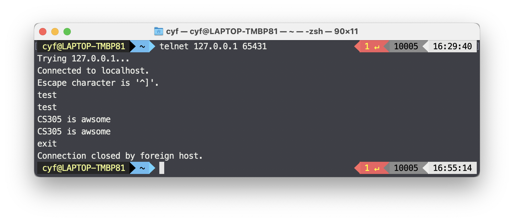

# CS305B Lab4 Report

*11812418 樊青远 Fan Qingyuan*

## Code

```python
import socket

HOST = '127.0.0.1'
PORT = 65431

with socket.socket(socket.AF_INET, socket.SOCK_STREAM) as s:
    s.bind((HOST, PORT))
    s.listen()
    conn, addr = s.accept()
    with conn:
        print('Connected by', addr)
        while True:
            data = conn.recv(1024)
            if not data:
                break
            if data and data != b'exit\r\n':
                conn.sendall(data)
            else:
                conn.close()
                break
```

In this program, we use python to initiate a socket which binds 127.0.0.1:65431, then if we send the packet that not equal to `b'exit\r\n'` , the server will reply what we send back to the client.

## Execution screenshot



As the screenshots shown above, when we send the text to the server via telnet, the server replies the same text. The server will terminate the connection if we send `exit`.