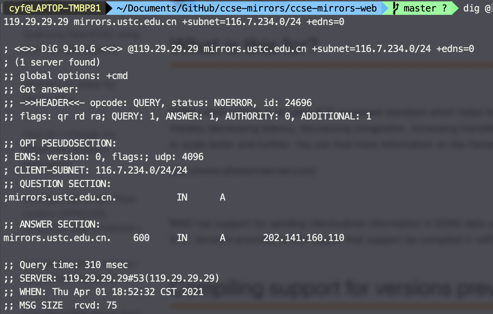
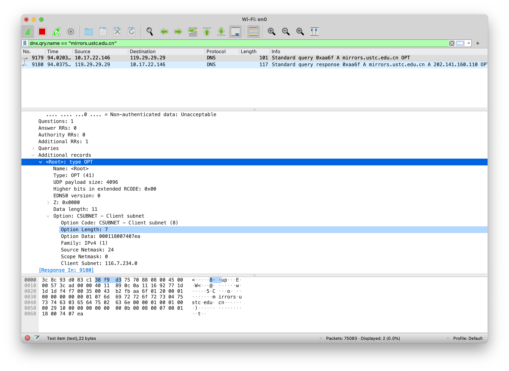
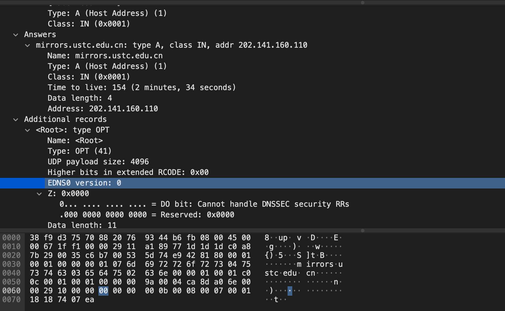
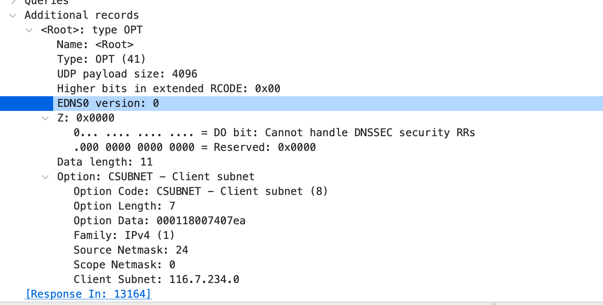
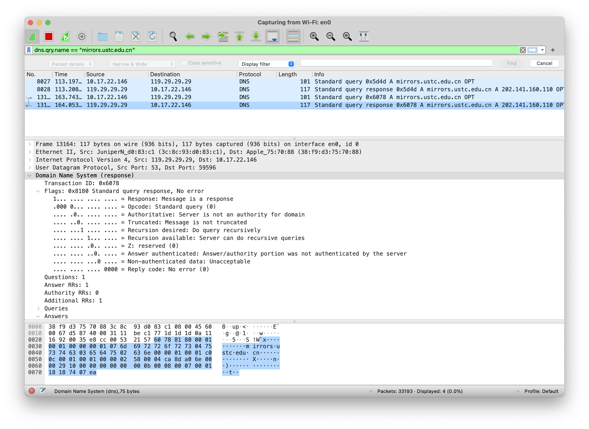
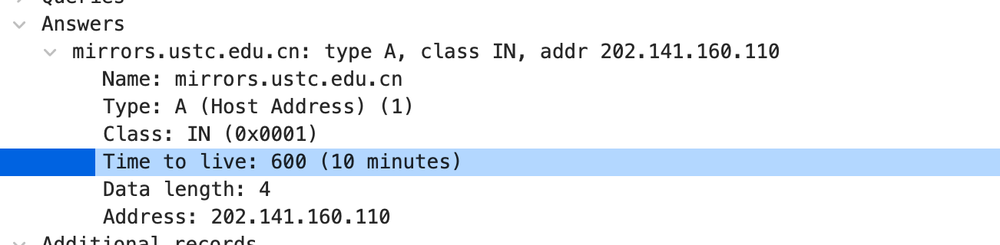
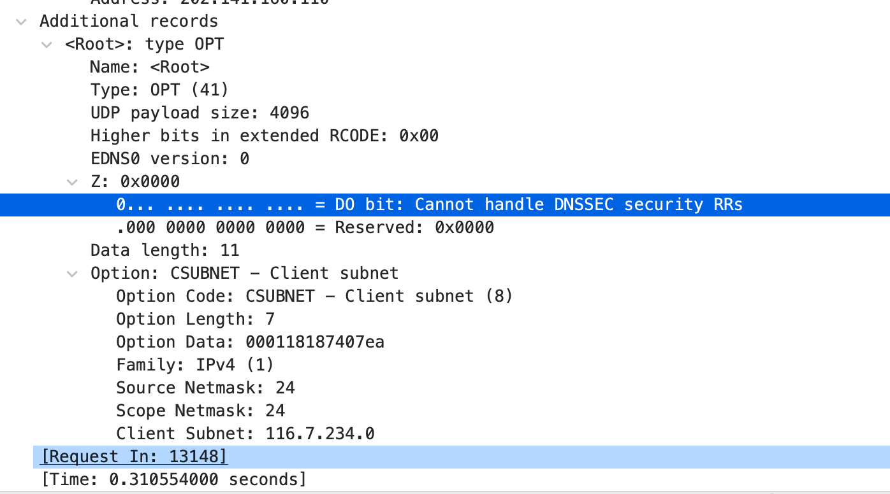
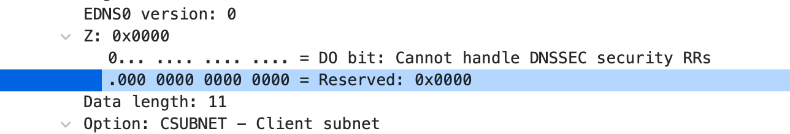
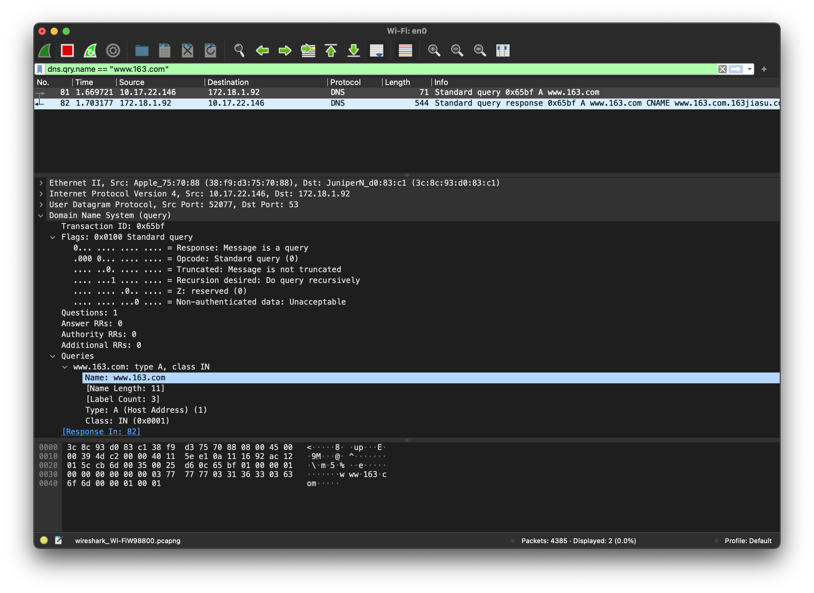
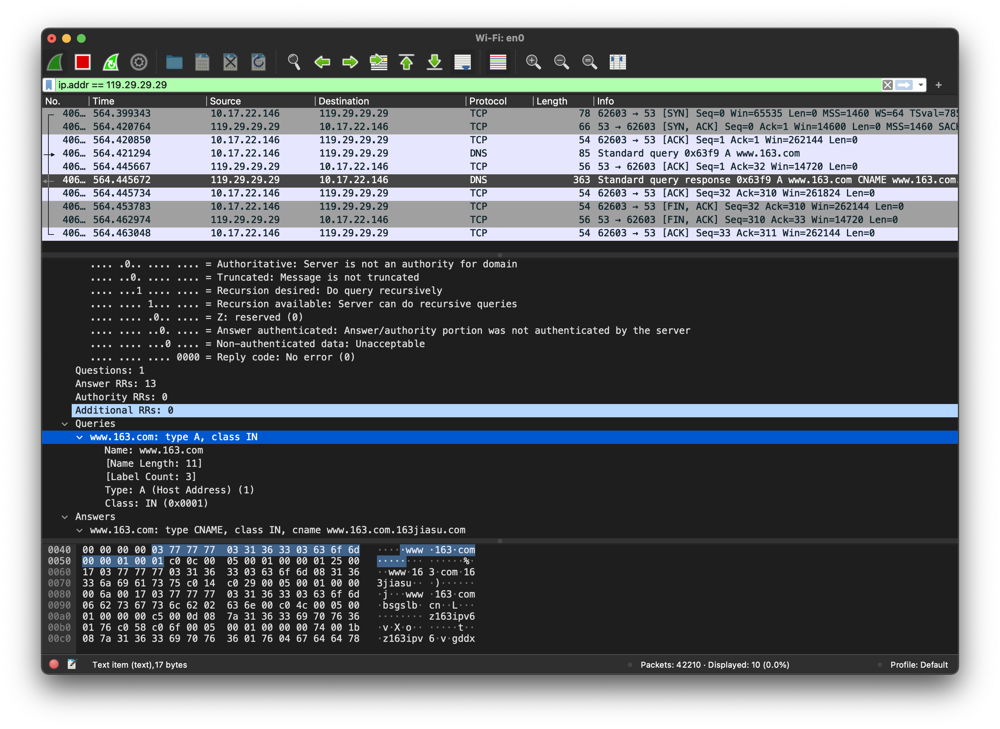

# CS305B Lab6 Report

*11812418 樊青远 Fan Qingyuan*

## 6.1 DNS Query with EDNS

```shell
dig @119.29.29.29 mirrors.ustc.edu.cn +subnet=116.7.234.0/24 +edns=0 
```

```shell
; <<>> DiG 9.10.6 <<>> @119.29.29.29 mirrors.ustc.edu.cn +subnet=116.7.234.0/24 +edns=0
; (1 server found)
;; global options: +cmd
;; Got answer:
;; ->>HEADER<<- opcode: QUERY, status: NOERROR, id: 24696
;; flags: qr rd ra; QUERY: 1, ANSWER: 1, AUTHORITY: 0, ADDITIONAL: 1

;; OPT PSEUDOSECTION:
; EDNS: version: 0, flags:; udp: 4096
; CLIENT-SUBNET: 116.7.234.0/24/24
;; QUESTION SECTION:
;mirrors.ustc.edu.cn.		IN	A

;; ANSWER SECTION:
mirrors.ustc.edu.cn.	600	IN	A	202.141.160.110

;; Query time: 310 msec
;; SERVER: 119.29.29.29#53(119.29.29.29)
;; WHEN: Thu Apr 01 18:52:32 CST 2021
;; MSG SIZE  rcvd: 75
```



### Capture by wireshark





### Query Content

Server name: `119.29.29.29` 

Length: 101

How can you tell this DNS query is based on EDNS0: We could find the `EDNS0 version` entity in wireshark log.



### What's response content

Info: 



TTL: 600 seconds



Authority RRs: No

Addition RRs: Yes

```
;; flags: qr rd ra; QUERY: 1, ANSWER: 1, AUTHORITY: 0, ADDITIONAL: 1
```



There still have some bits reserved in use. It only contains zero.



## 6.2 Python DNS query

### Make the query of python dns resolver to query A type by using UDP and TCP:

#### Find the difference between two commands, what’s the default transport lay protocol while invoke DNS query

The command to query with tcp needs to add the parameter `tcp=True`

UDP is the default portal while invoke DNS query.

#### UDP

```python
import dns
import dns.resolver

result = dns.resolver.query('www.163.com', 'A')
for ipval in result:
    print('IP', ipval.to_text())
```



#### How many UDP packets are captured in this stream, What is the port number used?

2 packets with port 53.

#### TCP

```python
import dns.resolver

my_resolver = dns.resolver.Resolver()
my_resolver.nameservers = ['119.29.29.29']

result = my_resolver.query('www.163.com', 'A', tcp=True)
for ipval in result:
    print('IP', ipval.to_text())
```



#### How many TCP packets are captured in this stream, What is the port number used?

10 Packets with port 53.

#### Is there any difference on query and response of DNS between using TCP and using UDP?

Unlike UDP, to initiate the TCP DNS query, the client needs handshake with the server first.

The contents of the DNS query response are same.


