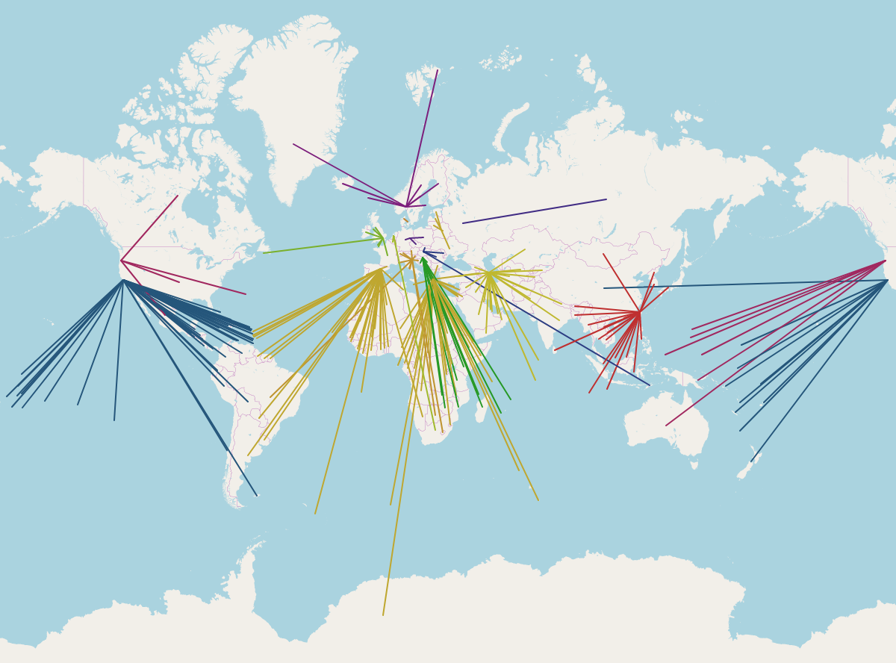

# Report on CDN: Common Techniques seems on CDN

*11812418 FanQingyuan*

---

## Table of Contents

[toc]

---

## Introduction

CDN is a common technology that is widely used by big tech to deliver content across the world. In this report, we use two popular cdns, cloudflare and jsdelivr as an example to ilustrate serval features and techniques that is widely adapted by the CDN.

## Locate the customer to the nearest CDN: Edge network, GeoDNS and Anycast IP

### Data Center and Edge Network

According to the introduction on [https://peering.google.com/#/](https://peering.google.com/#/), the big Tech like Google uses three types of infrastructure to insure the traffic efficiency and the cost-efficiency.


Specifically, the date of the user and the provider will be store on the datacenter across the world. When the end user wants to retrive their own data like file in Google Drive or images in Google Photo, google may server the content directly from the datacenter. However, when the end user watnts to retrive data that is popular in their own organisation or region, Google will redirect the user to the Edge Network or the Edge Node deployed in the local ISP or local internet exchange center (indicated by yellow circle in the figure above). Such structure ensures that the limited storage space in the Edge Network could be make full use for higher cost-efficiency, and the end user could also retrive the popular resources from their local ISP to eliminate the loading time of the content.


### GeoDNS

To allow the content provider to redirect the users to their nearest Edge Network, the content provider may need to use DNS as a measure to resolve the nearest IP geographically to the user. GeoDNS implements this approach.

<figure>
  
  <figcaption>GeoDNS of OpenStreetMaps CDN</figcaption>
</figure>

Using the image above as an example, the Openstreetsmap has multiple tile servers across the world, and they use `tile.openstreetmap.org` as their domain of the tile server. When the users in Hong Kong try to query the DNS record of the tile server, the nameserver of OSM will return `longma.openstreetmap.org` as its canonical name, and direct the client to the tile server in Taiwan, which is the closest aviable tile server in East Asia. On the contary, if the users in united state query the same domain, the nameserver of OSM will return `ascalon.openstreetmap.org` and direct the user to the server in United States.

Generally, the nameserver uses the IP that initiate the DNS query to determine the region of the client with the feature like EDNS subnet.

### Anycast

However, the system of GeoDNS needs to store an extra database table that project the IP to the corresponding geographical location (which generally provided by some security company like Maxmind, IPIP). The process of querying the database record could consume a lot of resources, which will bring a higher load to the DNS server. To make things simplier, some big CDN provider with wide-coverage BGP peering with the local ISP uses Anycast to diverse the traffic to the local CDN POP. Anycast is a network addressing and routing methodology in which a single destination IP address has multiple routing paths to two or more endpoint destinations, which indicates that when the client try to connect to the service, the IP resolved by the DNS could be only one or a few, and the work to choose the optimal route to these IP will be the local ISP and the CDN providers' resposibility.

For instance, the DNS `1.0.0.1` provided by cloudflare uses anycast to cast this IP all over the world. The user in Hong Kong Boardband Network could reach this IP with the path of `HKBN -> HKIX -> Cloudfare`, while the client in US whose ISP has direct peer with cloudflare use the path of `Cogent -> Cloudflare` to connect `1.0.0.1`. With the assistance of Anycast, both client could experience a low latency to the content.

```shell
# curl 1.0.0.1/cdn-cgi/trace
fl=23f218
h=1.0.0.1
ip=*
ts=1618731456.638
visit_scheme=http
uag=curl/7.74.0
colo=HKG
http=http/1.1
loc=HK
tls=off
sni=off
warp=off
gateway=off
```

<figure>
  
  <figcaption>Route to 1.0.0.1 from HKBN</figcaption>
</figure>

```shell
# curl 1.0.0.1/cdn-cgi/trace
fl=12f265
h=1.0.0.1
ip=*
ts=1618731413.841
visit_scheme=http
uag=curl/7.74.0
colo=LAX
http=http/1.1
loc=US
tls=off
sni=off
warp=off
gateway=off
```

<figure>
  
  <figcaption>Route to 1.0.0.1 from Cogent</figcaption>
</figure>

## Conclusion

The methods mentioned above effectively reduce the delay when the client accesses the CDN network, and at the same time maximize the caching characteristics of CDN. Nowadays, there are also many technology companies have placed some computing services in CDN, such as Cloudflare Worker, which provides the customer a way to do calculation by javascript directly on the Edge Network. 

<figure>
  
  <figcaption>Diagram of Cloudflare Worker</figcaption>
</figure>

Maybe in the near future, with the development of distributed computing and content provider place more computer componts direct on Edge Network instead of origin, the CDN will bring more benefits to end user and customers.

