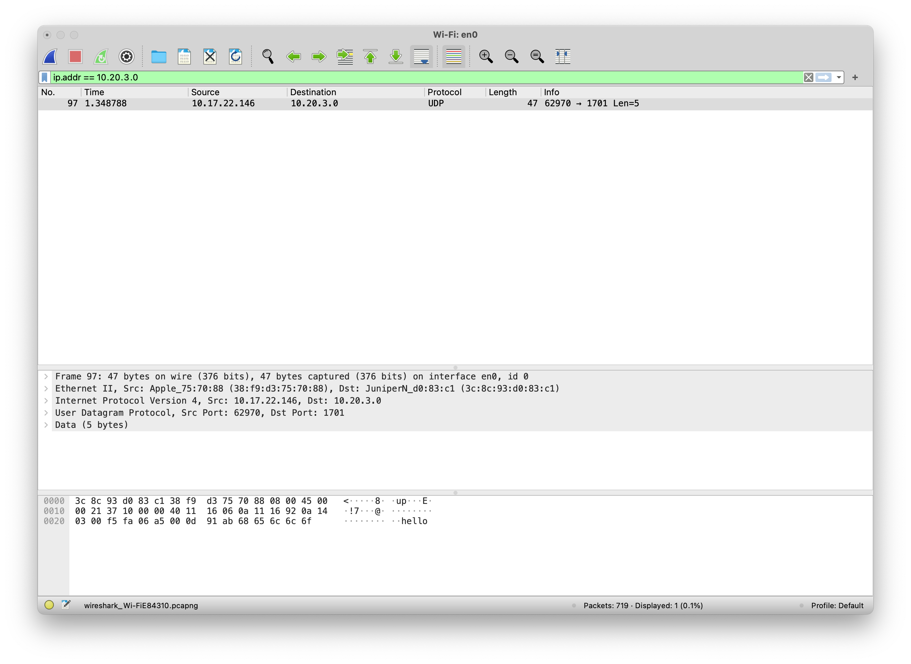
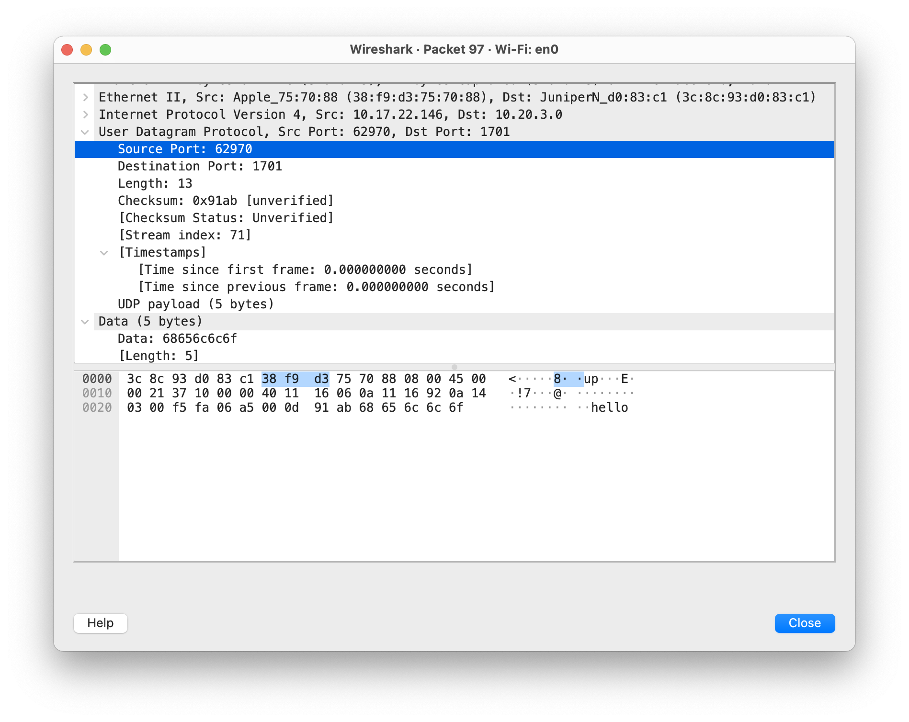
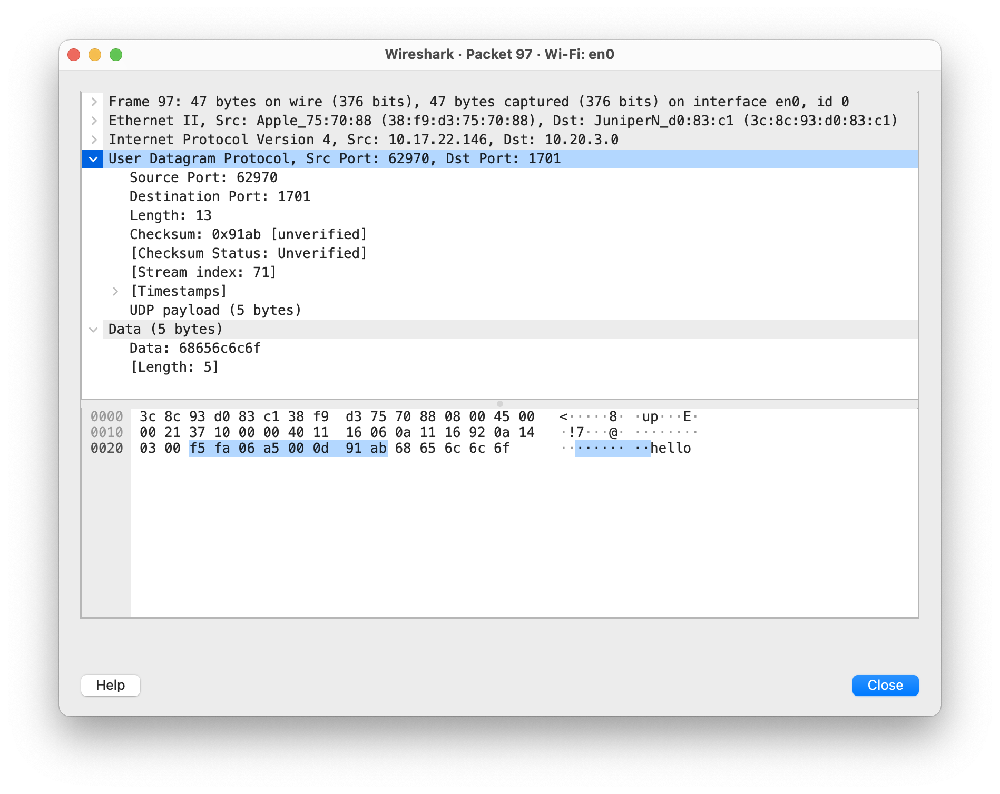
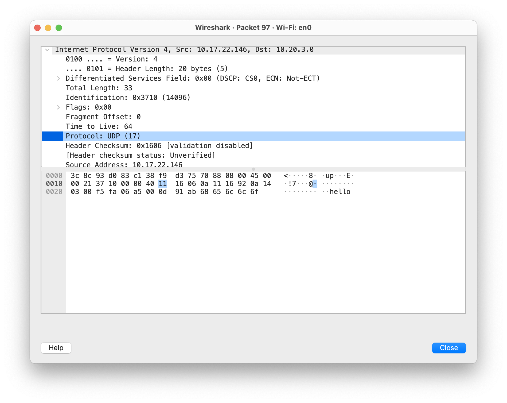
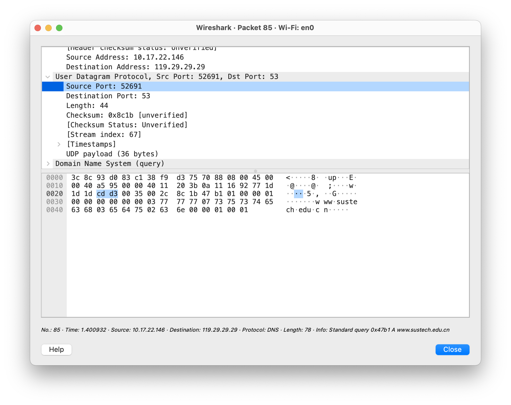
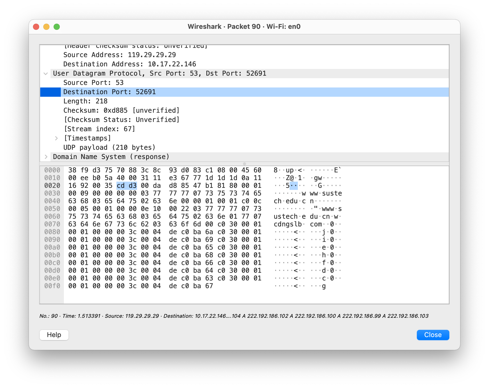

# CS305B Lab Report 8

*11812418 FanQingyuan*

---

>Select one UDP packet from your trace.

We initiate the udp packet with:

```shell
echo -n "hello" | nc -4u -w0 10.20.3.0 1701
```

Then, we capture the packet by wireshark:



### From this packet, determine how many fields there are in the UDP header. Name these fields.



4 Fields:

- Source Port
- Destination Port
- Length
- Checksum

### Consulting the displayed information in Wireshark’s packet content field for this packet, determine the length (in bytes) of each of the UDP header fields.



As the screenshot shows, the UDP header has 64bits (8 Bytes), each property has 16bits.

### The value in the Length field is the length of what? Verify your claim with your captured UDP packet.

The value in the Length field is the length of the segment, including the header, in bytes. In this packet, the length of the segment is `8(header) + 5("hello") = 13`

### What is the maximum number of bytes that can be included in a UDP payload?

The maximum number of bytes that can be included in a UDP payload is $2^{16}-1$ bytes plus the header bytes. This gives 65535 bytes – 8 bytes = 65527 bytes. 

### What is the largest possible source port number? 

$2^{16}-1=65535$

### What is the protocol number for UDP?



DEC: `17`

HEX: `11`

### Examine a pair of UDP packets in which your host sends the first UDP packet and the second UDP packet is a reply to this first UDP packet. Describe the relationship between the port numbers in two packets.

#### Sent packet



#### Received packet



The source port of the UDP packet sent by the host is as same as the destination port of the reply packet, the destination port of the UDP packet sent by the host is the same as the source port of the reply packet.