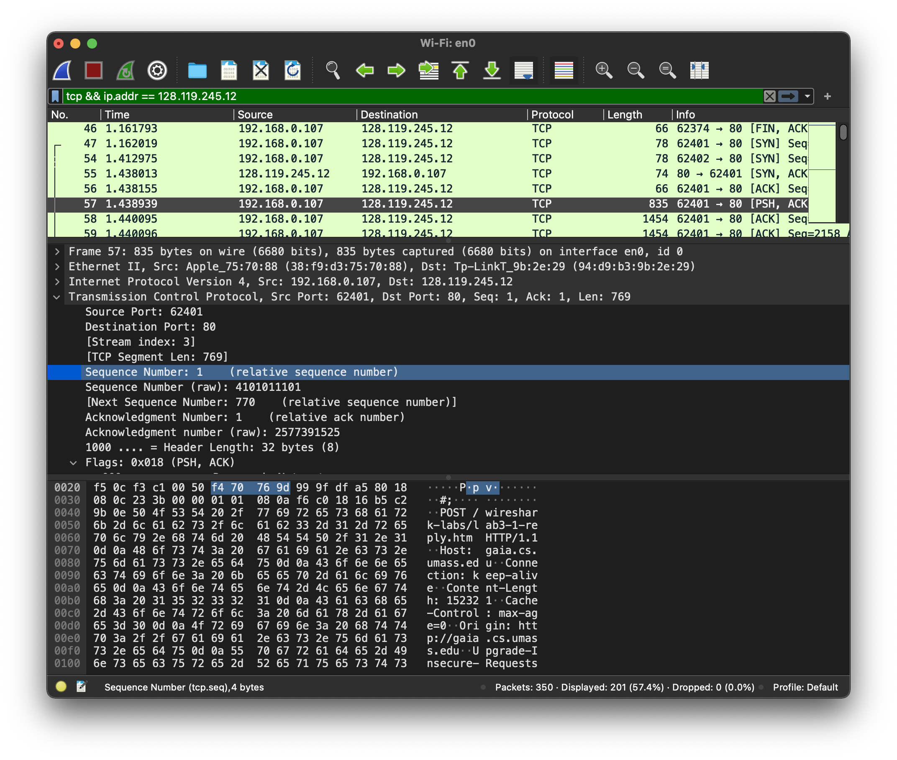

# CS305B Lab Report 9

*11812418 FanQingyuan*

>Questions 3-10 of Wireshark_TCP_v7.0.pdf

---

## 3

> What is the IP address and TCP port number used by your client computer (source) to transfer the file to gaia.cs.umass.edu?

IP address: `192.168.0.107`

TCP port number: `62401`

## 4

> What is the sequence number of the TCP SYN segment that is used to initiate the TCP connection between the client computer and gaia.cs.umass.edu? What is it in the segment that identifies the segment as a SYN segment?

Sequence number: `0`

The SYN flag is set to 1 and it indicates that this segment is a SYN segment

## 5

>What is the sequence number of the SYNACK segment sent by gaia.cs.umass.edu to the client computer in reply to the SYN? What is the value of the Acknowledgement field in the SYNACK segment? How did gaia.cs.umass.edu determine that value? What is it in the segment that identifies the segment as a SYNACK segment?

SYNACK sequence number: `0`

Valuse of acknowledgement field in the SYNACK segment sequence number: `1`

The value of the ACKnowledgement field in the SYNACK segment is determined by adding 1 to the initial sequence number of SYN segment from the client.

The SYN flag and Acknowledgement flag in the segment are set to 1 and they indicate that this segment is a SYNACK segment.

## 6

> What is the sequence number of the TCP segment containing the HTTP POST command? Note that in order to find the POST command, you’ll need to dig into the packet content field at the bottom of the Wireshark window, looking for a segment with a “POST” within its DATA field.

Sequence number: `1`

## 7

> Consider the TCP segment containing the HTTP POST as the first segment in the TCP connection. What are the sequence numbers of the first six segments in the TCP connection (including the segment containing the HTTP POST)? At what time was each segment sent? When was the ACK for each segment received? Given the difference between when each TCP segment was sent, and when its acknowledgement was received, what is the RTT value for each of the six segments? What is the EstimatedRTT value (see Section 3.5.3, page 242 in text) after the receipt of each ACK? Assume that the value of the EstimatedRTT is equal to the measured RTT for the first segment, and then is computed using the EstimatedRTT equation on page 242 for all subsequent segments.

| Segment NO | Capture NO | Capture NO (ACK) | Sequence number | Sent time (s) | ACK received time (s) | RTT (s)  | Estimate RTT |
| ---------- | ---------- | ---------------- | --------------- | ------------- | --------------------- | -------- | ------------ |
| 1          | 57         | 72               | 1               | 1.438939      | 1.687464              | 0.248525 | 0.2485       |
| 2          | 58         | 75               | 770             | 1.440095      | 1.726096              | 0.286001 | 0.2813       |
| 3          | 59         | 77               | 2158            | 1.440096      | 1.729284              | 0.289188 | 0.2841       |
| 4          | 60         | 80               | 3546            | 1.440098      | 1.729821              | 0.289723 | 0.2846       |
| 5          | 61         | Segment Lost     | 4934            | 1.440098      | Lost                  | -        | -            |
| 6          | 62         | 81               | 6322            | 1.440099      | 1.729826              | 0.289727 | 0.2846       |

$EstimatedRTT = 0.875 * EstimatedRTT + 0.125 * SampleRTT$

## 8

> What is the length of each of the first six TCP segments?

| Segment NO | Capture NO | Length |
| ---------- | ---------- | ------ |
| 1          | 57         | 769    |
| 2          | 58         | 1388   |
| 3          | 59         | 1388   |
| 4          | 60         | 1388   |
| 5          | 61         | 1388   |
| 6          | 62         | 1388   |

## 9

> What is the minimum amount of available buffer space advertised at the received for the entire trace? Does the lack of receiver buffer space ever throttle the sender?

minimum amount of available buffer space: `28960`

The sender is never throttled due to lacking of receiver buffer space by inspecting this trace.

## 10

> Are there any retransmitted segments in the trace file? What did you check for (in the trace) in order to answer this question?

Yes, in the screenshot below, while the tcp stream encountered a retransmission, the windows size was reset to `2060`.

