# CS305B Project: Design School Network with VLANs Using Packet Tracer

*11812418 FanQingyuan*

----

[toc]


## Introduction

Campus networks tend to be large in scale and often have multiple types of devices. For securely and efficiently manage access to network users, using VLAN to split the network into multiple "section" according to the role of the client is needed.

## Network Structure

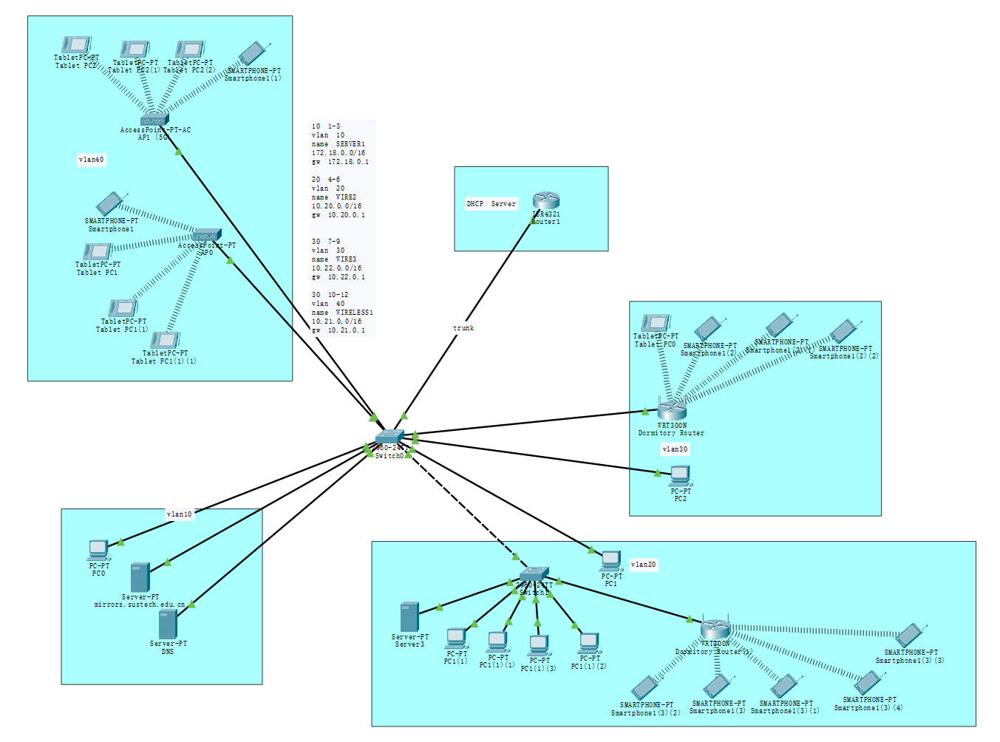

## Planning the VLAN and the IP range

We have defined four network types based on the specification and the security requirements of the device, the corresponding table illustrate our definition. The type of equipment is derived from the real campus network environment in SUSTech.

| Type                                       | VLAN Tag ID | IP Range      | Gateway    | VLAN Name |
| ------------------------------------------ | ----------- | ------------- | ---------- | --------- |
| Server                                     | 10          | 172.18.0.0/16 | 172.18.0.1 | SERVER1   |
| Wired Client                               | 20          | 10.20.0.0/16  | 10.20.0.1  | WIRE2     |
| Wired Client Network (Self-Paid Broadband) | 30          | 10.22.0.0/16  | 10.22.0.1  | WIRE3     |
| Wirelsess                                  | 40          | 10.21.0.0/16  | 10.21.0.1  | WIRELESS4 |

## Configure the core router and switcher

With VLAN isolation and VLAN id limit on the ethernet port, we can place all clients within the same Layer 2 network. In our design, we use a Cisco 2960 switch as our core switch and Cisco 4321 Integrated Services Router as the core router for VLAN assigning and DHCP stuff.

### Switch

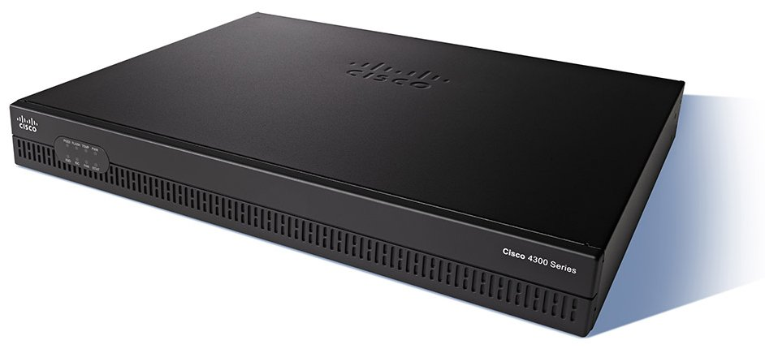

#### Enter Terminal

After the switch boot up, we needs to login into the terminal, most of the configuration interface of the Cisco device use the following command to login into the configuration shell:

```
enable
configure terminal
```

After finish each process, we can use `Ctrl+Z` to exit current configuration manual.

#### Name VLAN

To make the follow-up easier, we first name the VLAN, the following code is a example to add and rename the `VLAN 10` to `SERVER1` (it can also be done in GUI Panel):

```shell
vlan 10
name SERVER1
```

#### Tag Port

Secondly, we configure the VLAN tag of each port of the switch. The Cisco 4321 provide 24 ethernet port with 100Mbps Link and two ports with 1GE port. In our design, we limit port `fa0/1-3` to `VLAN 10`, port `fa0/4-6` to `VLAN 20`, port `fa0/7-9` to `VLAN 10`, port `fa0/10-12` to `VLAN 10`,  `gi0/1` as the trunk link to the Core Router.

The following code limit port `fa0/1-3` to `VLAN 10`, and set the port as "power on on boot":

```
int range fa0/1-3
no shutdown 
switchport mode access
switchport access vlan 10
```

The following code set the `gi0/1` as trunk mode:

```
int gi 0/0/0
no shutdown
switchport mode trunk
```

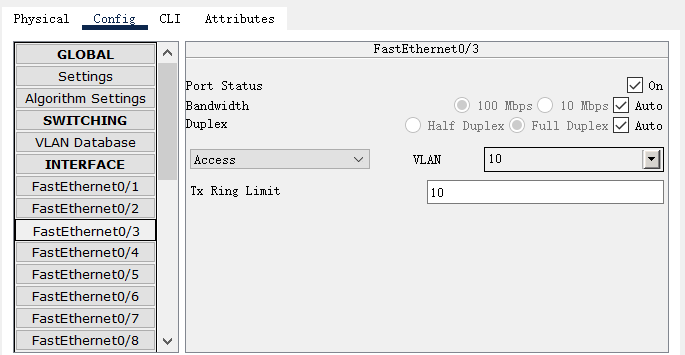

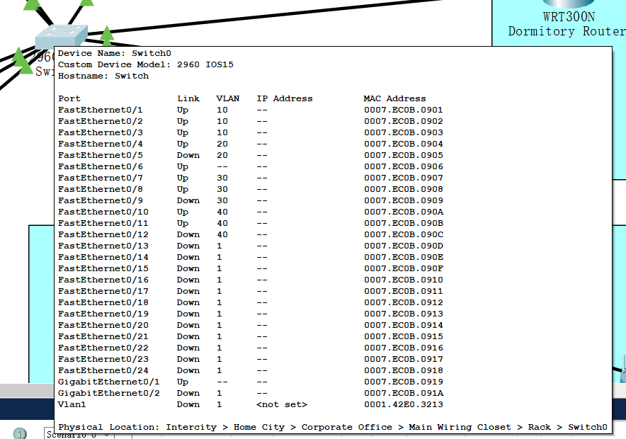

### Router

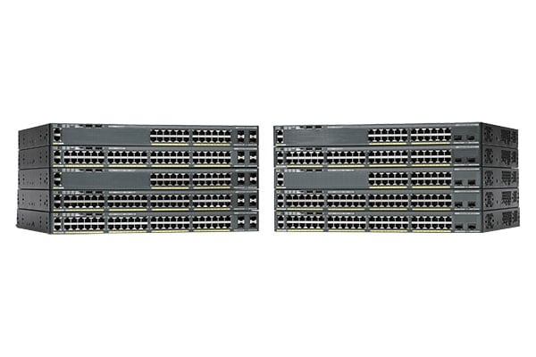

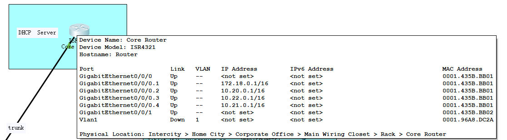

#### Enter Terminal

```
enable
configure terminal
```

#### Let port `gi0/0/0/` start on boot

```
int gi0/0/0
no shutdown
```

#### Configure Gateway

In the physical layer, the `gi0/1` of the switch is connected to the `gi 0/0/0` of the router, which means there are three "virtual ports" (VLANs) are also connected to the router. The VLAN can be distinguished by the last digit of the port name. In our design, the virtual port corresponding to `VLAN 10` is `int gi0/0/0.1`, virtual port corresponding to `VLAN 20` is `int gi0/0/0.2`, virtual port corresponding to `VLAN 30` is `int gi0/0/0.3`, virtual port corresponding to `VLAN 10` is `int gi0/0/0.4`. 

Then, we add the IP address for each VLAN port, this address is also known as the gateway of each VLAN (we use `encapsulation` command to specify the relationship between the port and the VLAN ID):

```
int gi0/0/0.1
ip address 172.18.0.1 255.255.0.0
encapsulation dot1Q 10

int gi0/0/0.2
ip address 10.20.0.1 255.255.0.0
encapsulation dot1Q 20

int gi0/0/0.3
ip address 10.22.0.1 255.255.0.0
encapsulation dot1Q 30

int gi0/0/0.4
ip address 10.21.0.1 255.255.0.0
encapsulation dot1Q 40
```

#### Add DHCP Pool

The last part of the router configuration is to create and assign the DHCP pool for each VLAN:

```
ip dhcp pool server1vlan10
network 172.18.0.0 255.255.0.0 
default-router 172.18.0.1

ip dhcp pool wire2vlan20
network 10.20.0.0 255.255.0.0 
default-router 10.20.0.1
dns-server 172.18.1.92

ip dhcp pool wire3vlan30
network 10.22.0.0 255.255.0.0 
default-router 10.22.0.1

ip dhcp pool wireless1vlan40
network 10.21.0.0 255.255.0.0 
default-router 10.21.0.1
```

We could also write the configuration we made into nvram of the router/switch to prevent the possible data loss after power loss:

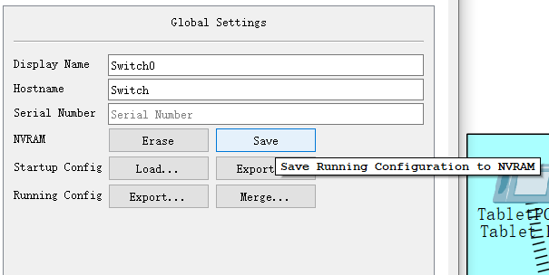


## Configure the Clients

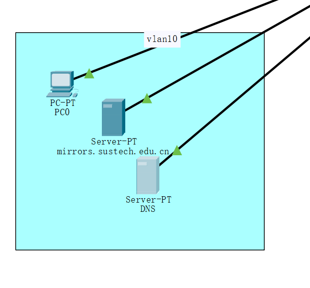

### Server (`VLAN 10`)

In our design, the server was all placed in VLAN 10 with static IP address.

#### DNS server

Same as campus network, we assign a server with static address `172.18.1.92` as our DNS server.

To configure the server as static address client, we need to set the IP address and mask at `Config ` tab:

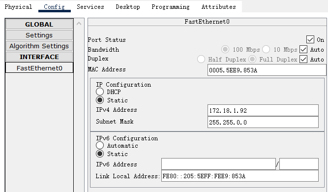

and set the IPv4 gateway at `global`-`setting` tab.

We also need to enable the DNS server at the `Service ` tab and add the DNS record:

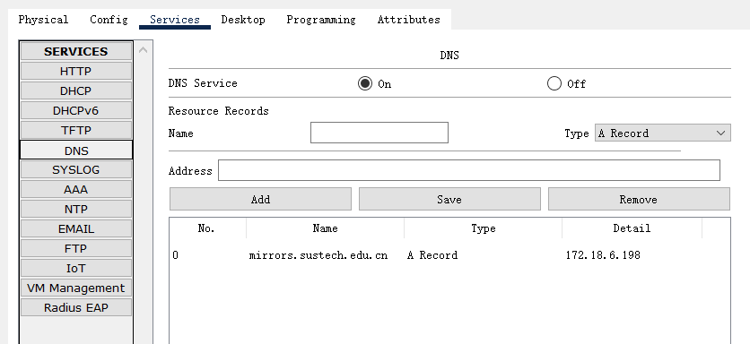

#### HTTP Server

We also put a HTTP server "`mirrors.sustech.edu.cn`" inside VLAN10, which use static IPv4 address `172.18.6.198` and enable the HTTP server:

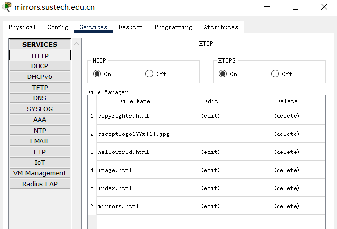

### Client

#### PC (`VLAN10`, `VLAN20`, `VLAN30`)

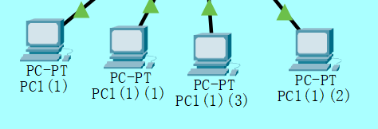

For the PC in the network, we just need to set their IPv4 as DHCP in `Desktop` - `IP configuration`:

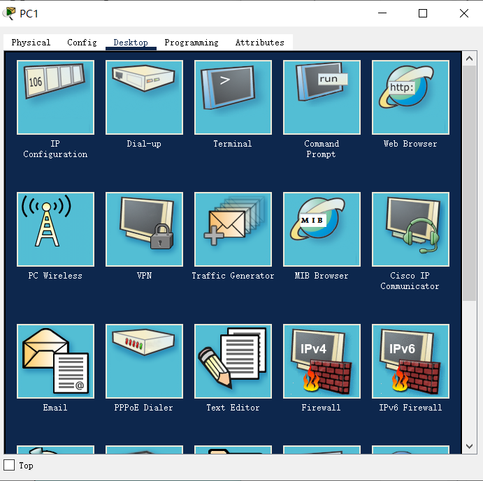

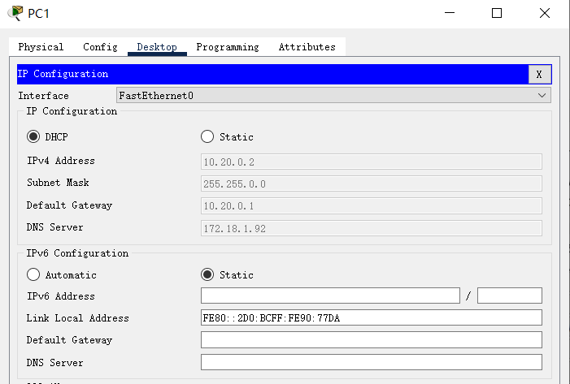

The client will acquire their IP from the router after a while.

#### Tablet and Mobile Phone (`VLAN20`, `VLAN30`, `VLAN40`)


The difference between mobile devices and PCs is that mobile devices need to be configured with wireless networks in order to access the campus network we designed.

We can configure the wireless network by entering the SSID and the network password at `Config` - `Wireless` tab:

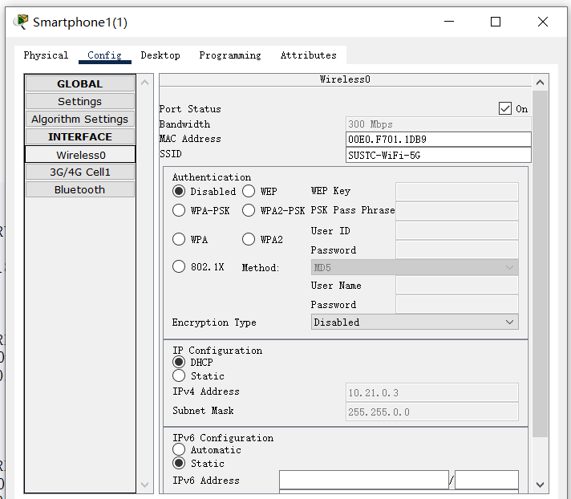

After the correct configuration, the device will enter the layer 2 network and get their IP address by DHCP in seconds.

## Configure the Secondary Router and Switch Device

Besides the core router and the switch, there are also some switch, access point and router in every VLAN for multiple purpose.

### Switch (`VLAN20`)

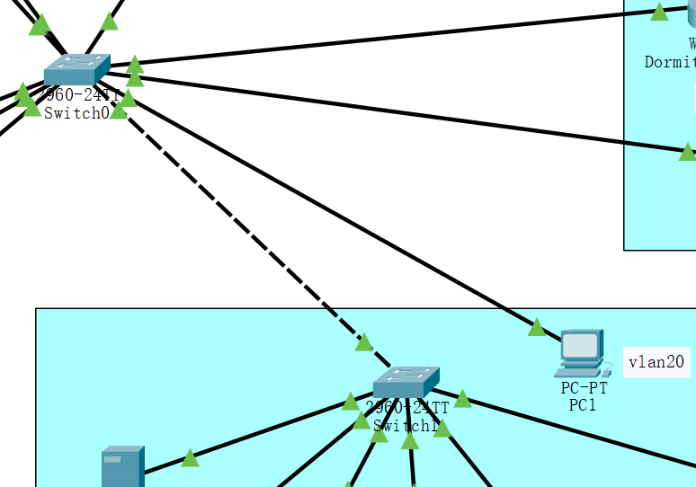

As the core switch only provide us 3 ports for the VLAN 20, we add a separate switch to provide more ports for VLAN 20. The new switch use the trunk link to link to the core switch, so it could also be used as an extension of other VLAN. Then, we tag the `fa0/1-24` as VLAN20 to only allow the packet in VLAN20 to pass. The client linked under the router could also get the IPv4 in `wire2vlan20` via DHCP.

### Access Point (`VLAN40`)

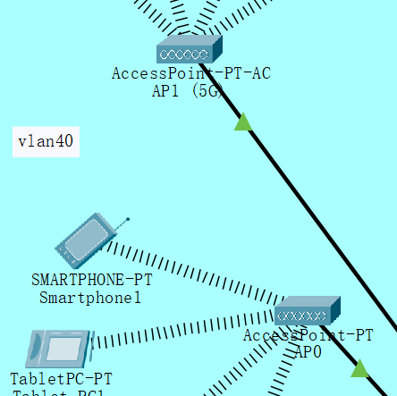

The function of access point is quite similar to the switch. However, as the AP have not the ability to filter the VLAN tag. All of the AP in out network is placed in VLAN40, which has also been splitted into two AP: AP0 for 2.4GHz SSID `SUSTC-WiFi`, and AP1 for 5.8GHz SSID `SUSTC-WiFi-5G`. What we need to configure is set the SSID and the optional password and encryption method of the network in `config` tab:

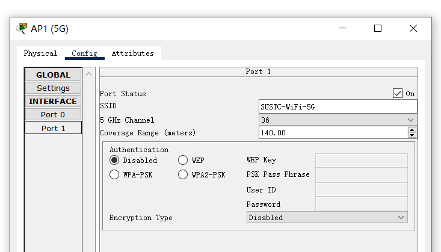

### WRT300N Router (`VLAN20`, `VLAN30`)

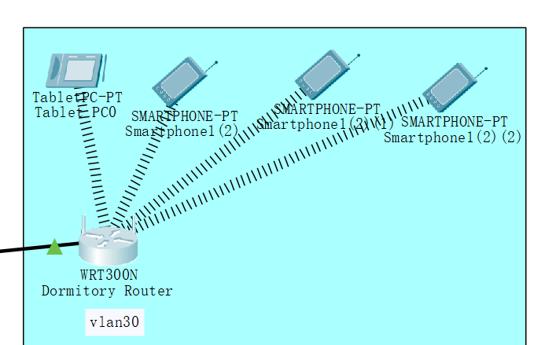

The WRT300N router is a home use router produced by Linksys, a subsidiaries of Cisco. It could work as a switch, a router and a NAT device. The option we need to configure is its wireless SSID, WAN port mode (DHCP) and DHCP IP pool of the LAN port.

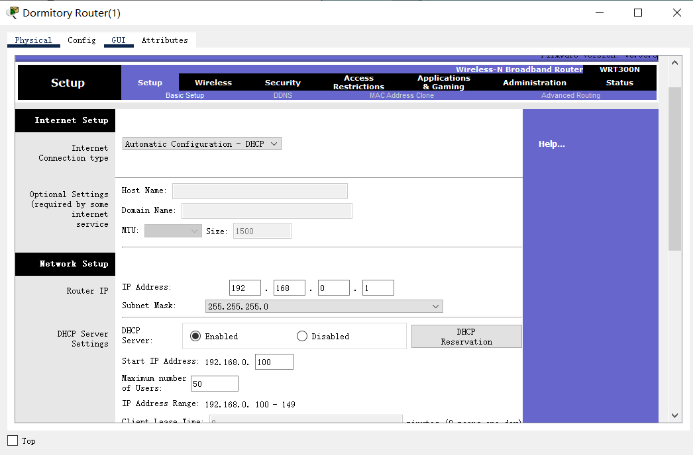

## Test the network

### Ping and Traceroute

#### From the mobile device in `VLAN40` to `VLAN10` 

src: `10.20.0.9`

dst: `172.18.1.92` (DNS)

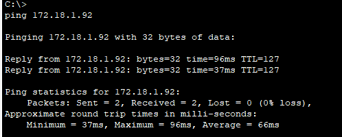

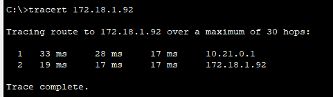

#### From the mobile device in `VLAN30` to `VLAN10` 

src: `192.168.0.102` in Dormitory Router

dst: `172.18.1.92` (DNS)

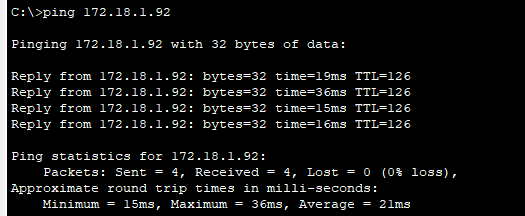

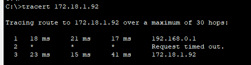

### Nslookup

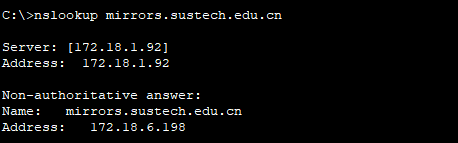


### HTTP Get

#### From the mobile device in `VLAN20` to `VLAN10` 

src: `192.168.0.102` in Dormitory Router

dst: `172.18.1.92` (DNS)

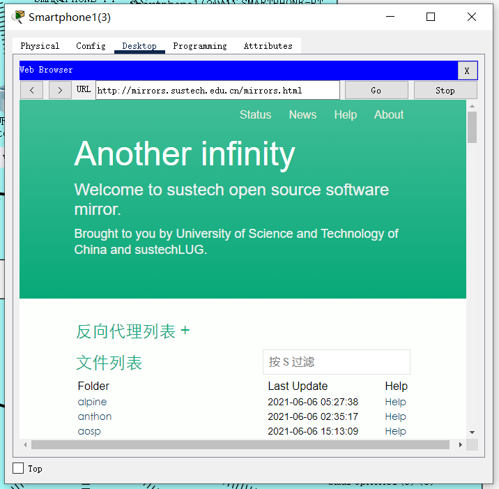

## Conclusion

In this project, we designed a campus network with 4 VLANs, 34 host and 3 router and wired as well wireless connection. Through this experiment, we have a deeper understanding of the workflow of VLAN and the applicable scenarios

